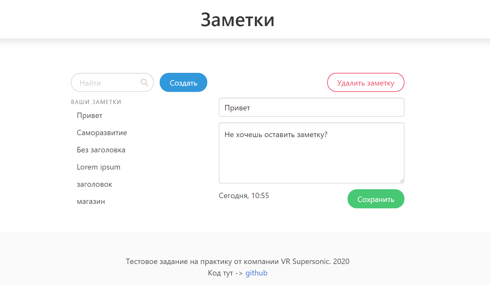

# Notes
Тестовое задание на практику (веб-разработка, C#) от компании VR Supersonic. 2020

Сервис для заметок, представляющий из себя Single Page Application.

>ТЗ:
>Заметка - это текст, заголовок + содержимое. Заголовка может не быть.

>Сценарии использования: 

>0. По умолчанию пользователь видит список заметок;
>1. Создать заметку;
>2. Изменить заголовок/содержимое заметки;
>3. Удалить заметку;
>4. Найти все заметки по подстроке (поиск сначала по заголовку, потом по содержимому).

В этом репозитории собранный проект, готовый к деплою.

Отдельно backend [тут](https://github.com/Dimedrolity/Notes-backend). Отдельно frontend [тут](https://github.com/Dimedrolity/Notes-frontend).

Результат:

